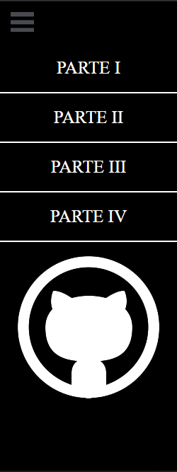
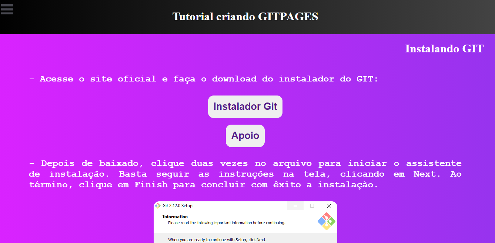
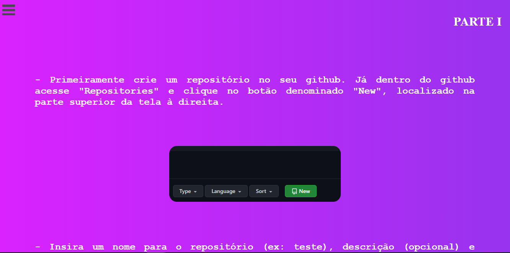
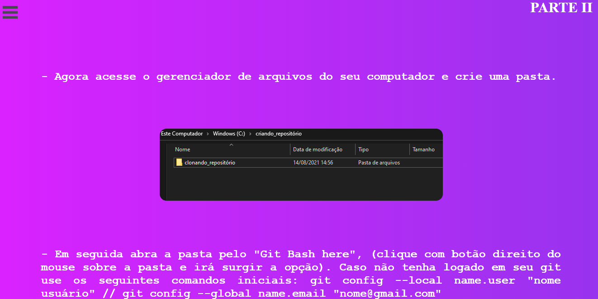
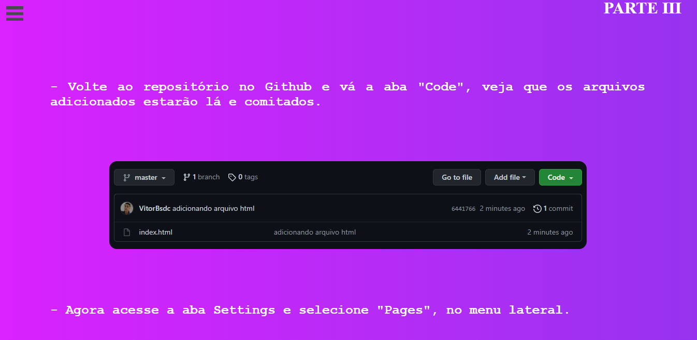
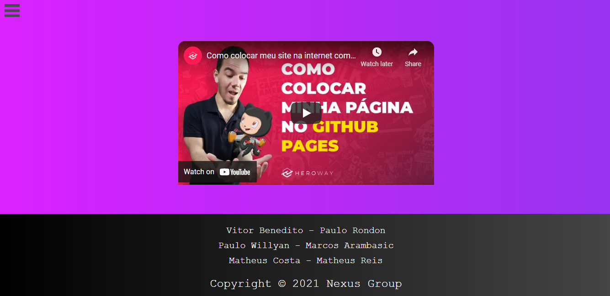

<h1 align="center">Site_tutorial</h1>
 <h4 align="center"> 
	🚧  Site_tutorial 🚀 Completo ✅
</h4>

Site feito para ajudar a comunidade a usar o git, github e o gitpages

Tabela de conteúdos
=================
<!--ts-->
   * Features
   * Pré-Requisitos
   * Tecnologias
   * Site
   * Contribuidores 
<!--te-->

<h2>Features</h2>

- [x] Menu Lateral 
- [x] Video Tutorial  
### Pré-requisitos

Antes de começar, você irá precisar ter instalado em sua máquina a seguinte ferramenta:
[Git](https://git-scm.com). 
Além disto é recomendável utilizar um editor para trabalhar com o código como [VSCode](https://code.visualstudio.com/)

### 🛠 Tecnologias

As seguintes ferramentas foram usadas na construção do projeto:

- HTML
- CSS

## Site 

 Menu lateral usado no site 

<h1 align="center">
  
</h1>

 Tutorial de instalar o git 

<h1 align="center">
  
</h1>

 Criação de conta 

<h1 align="center">
  
</h1>

 Parte I 

<h1 align="center">
  
</h1>

 Parte II 

<h1 align="center">
  
</h1>

 Parte III 

<h1 align="center">
  
</h1>

 Parte IV 

<h1 align="center">
  
</h1>

 Footer 

<h1 align="center">
  
</h1>

## 👨‍💻 Contribuidores

Vitor Benedito - Paulo Rondon -
Paulo Willyan - Marcos Arambasic -
Matheus Costa - Matheus Reis

